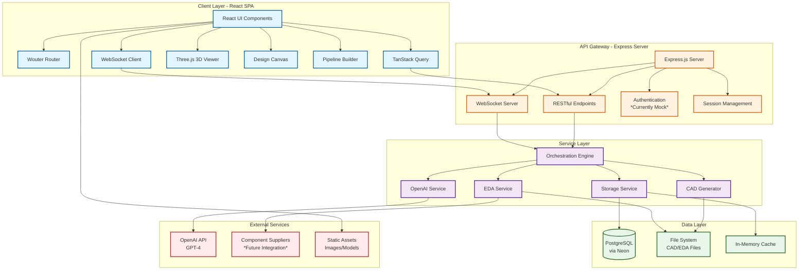
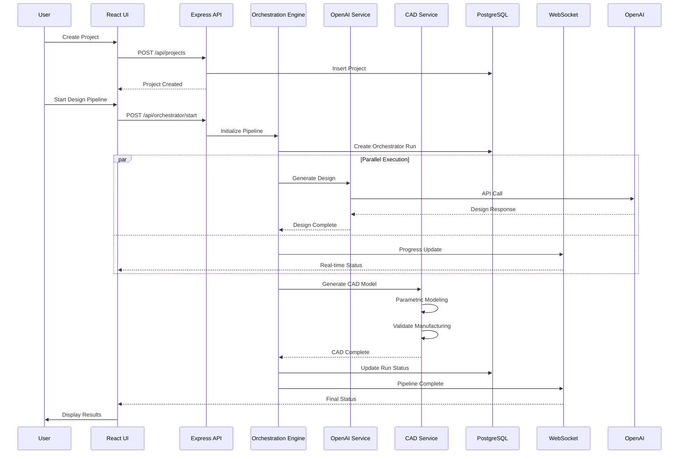
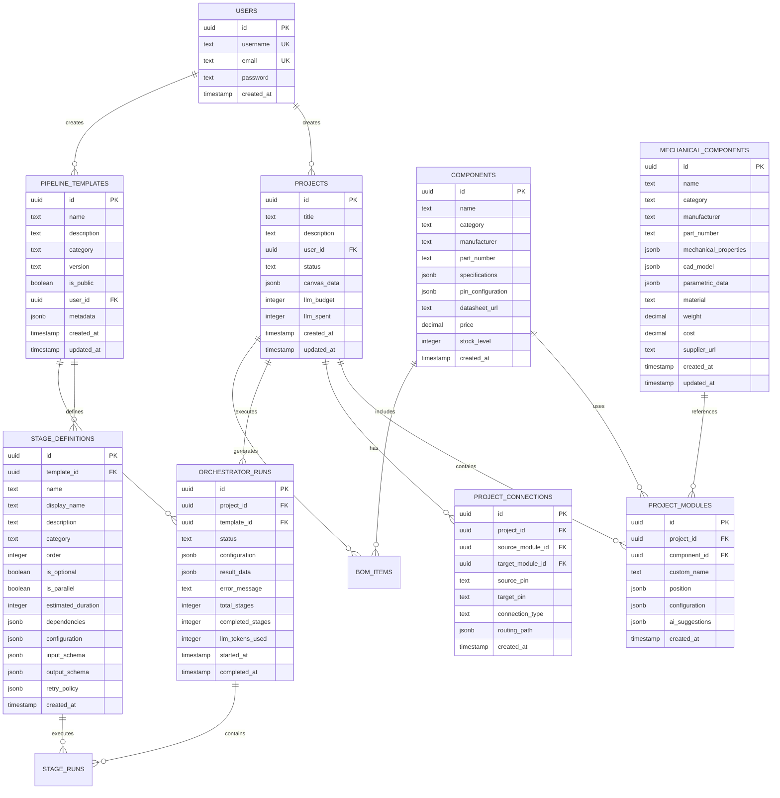
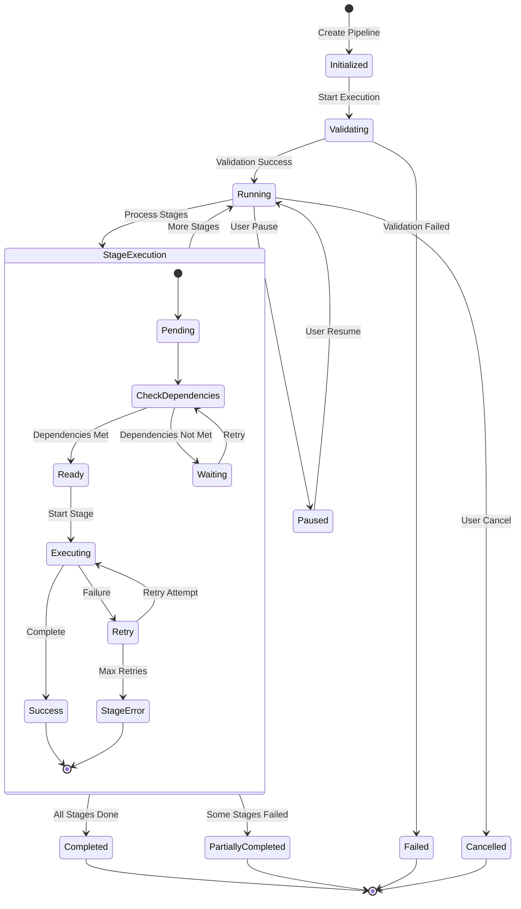
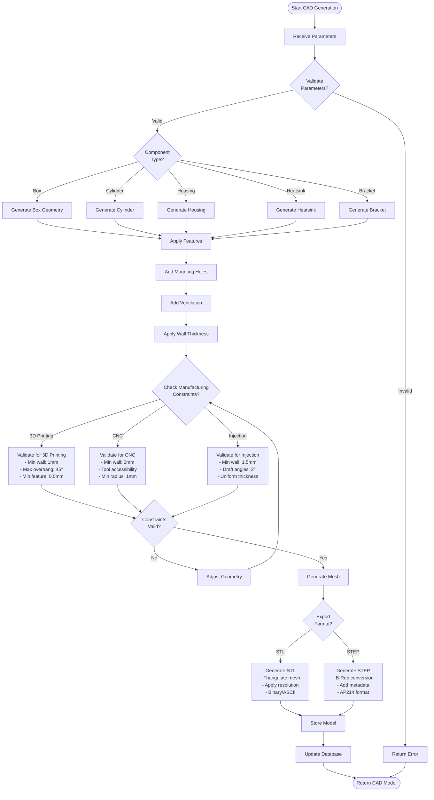
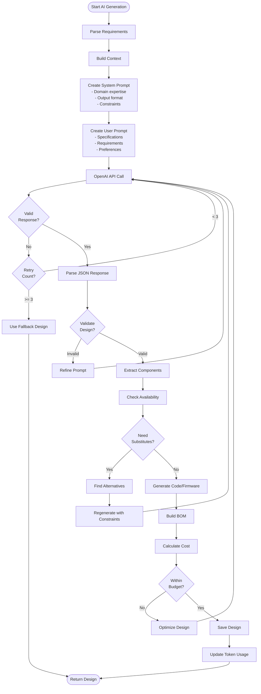
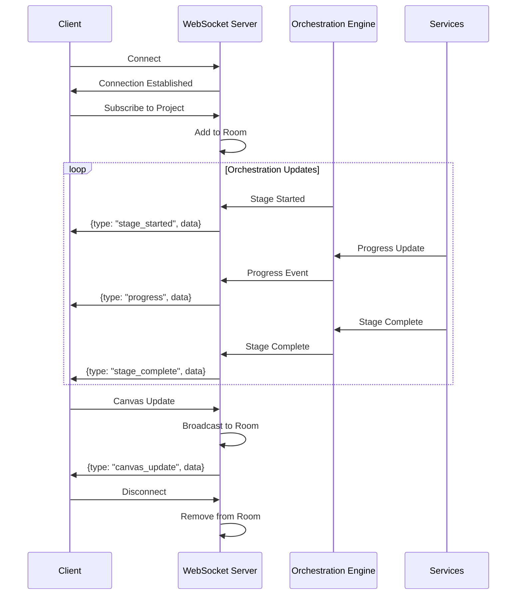
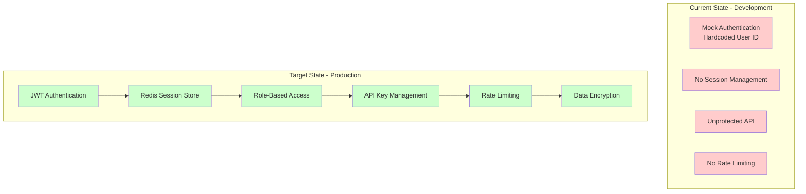
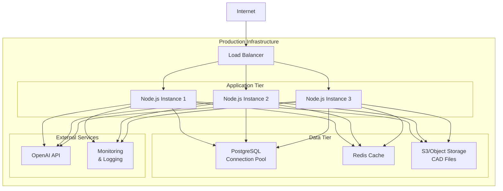

# Tyton Orchestrator V0.2.0 - Full Stack Architecture Documentation

## System Overview

Tyton Orchestrator is a comprehensive hardware design automation platform that combines AI-powered design generation, CAD/EDA tools, and visual pipeline orchestration to streamline the hardware development lifecycle from concept to manufacturing-ready designs.

## Architecture Diagram



## Component Architecture

### Frontend Architecture

```mermaid
graph LR
    subgraph "React Application Structure"
        App[App.tsx<br/>Root Component]

        subgraph "Pages"
            Home[Home Page]
            Project[Project Page]
            PipelineManager[Pipeline Manager]
        end

        subgraph "Core Components"
            AppHeader[App Header]
            DesignCanvas[Design Canvas]
            ComponentLibrary[Component Library]
            PropertiesPanel[Properties Panel]
            OrchestrationPanel[Orchestration Panel]
        end

        subgraph "Visualization"
            CADViewer[CAD Viewer]
            PipelineViz[Pipeline Visualization]
            PipelineBuilder[Pipeline Builder]
            NodeGraph[Node Graph Editor]
        end

        subgraph "UI Library"
            ShadcnUI[shadcn/ui Components]
            Dialogs[Dialogs & Modals]
            Forms[Form Components]
            DataDisplay[Data Display]
        end

        App --> Pages
        Pages --> CoreComponents
        Pages --> Visualization
        CoreComponents --> UILibrary
        Visualization --> UILibrary
    end

    subgraph "State Management"
        QueryClient[Query Client]
        LocalState[Component State]
        WSState[WebSocket State]
        FormState[Form State<br/>React Hook Form]
    end

    subgraph "Services"
        API[API Client]
        WSClient[WebSocket Client]
        FileHandler[File Handler]
    end

    Pages --> State Management
    CoreComponents --> Services
```

### Backend Service Architecture

```mermaid
graph TD
    subgraph "API Layer"
        Routes[routes.ts]
        Middleware[Middleware]
        ErrorHandler[Error Handler]

        Routes --> Middleware
        Middleware --> ErrorHandler
    end

    subgraph "Business Logic"
        ProjectMgmt[Project Management]
        ComponentMgmt[Component Management]
        PipelineMgmt[Pipeline Management]
        OrchestrationCtrl[Orchestration Controller]

        Routes --> ProjectMgmt
        Routes --> ComponentMgmt
        Routes --> PipelineMgmt
        Routes --> OrchestrationCtrl
    end

    subgraph "Service Layer Details"
        subgraph "AI Service"
            DesignGen[Design Generator]
            CircuitGen[Circuit Generator]
            FirmwareGen[Firmware Generator]
            Validation[AI Validation]
        end

        subgraph "CAD Service"
            ParamModel[Parametric Modeling]
            MfgValid[Manufacturing Validation]
            STLExport[STL Export]
            STEPExport[STEP Export]
        end

        subgraph "EDA Service"
            SchematicGen[Schematic Generation]
            KiCadExport[KiCad Export]
            BOMGen[BOM Generation]
            NetlistGen[Netlist Generation]
        end

        subgraph "Orchestration"
            PipelineExec[Pipeline Executor]
            StageRunner[Stage Runner]
            DepResolver[Dependency Resolver]
            RetryMgr[Retry Manager]
            ProgressTracker[Progress Tracker]
        end
    end

    ProjectMgmt --> AI Service
    ComponentMgmt --> CAD Service
    PipelineMgmt --> Orchestration
    OrchestrationCtrl --> Orchestration

    Orchestration --> AI Service
    Orchestration --> CAD Service
    Orchestration --> EDA Service
```

## Data Flow Architecture



## Database Schema Architecture



## Pipeline Orchestration Logic



## CAD Generation Algorithm



## AI Design Generation Flow



## WebSocket Communication Protocol



## Security Architecture (Current vs Target)



## Deployment Architecture



## Technology Stack

### Frontend
- **Framework**: React 18 with TypeScript
- **Routing**: Wouter
- **State Management**: TanStack Query, React Hook Form
- **UI Components**: shadcn/ui (Radix UI primitives)
- **Styling**: TailwindCSS
- **3D Visualization**: Three.js, React Three Fiber
- **Graph Visualization**: XYFlow React
- **Build Tool**: Vite

### Backend
- **Runtime**: Node.js with TypeScript
- **Framework**: Express.js
- **Real-time**: WebSocket (ws)
- **Database**: PostgreSQL (Neon Serverless)
- **ORM**: Drizzle ORM
- **Validation**: Zod
- **AI Integration**: OpenAI SDK

### Infrastructure
- **Development**: Vite Dev Server
- **Production Build**: ESBuild
- **Database Hosting**: Neon (PostgreSQL)
- **Environment**: Node.js 20+

## Performance Considerations

1. **Database Optimization**
   - Connection pooling via Neon
   - Indexed queries on frequently accessed columns
   - JSONB for flexible schema fields

2. **Caching Strategy**
   - In-memory cache for component library
   - Query caching via TanStack Query
   - Potential Redis integration for production

3. **Real-time Performance**
   - WebSocket for low-latency updates
   - Debounced canvas updates
   - Efficient diff algorithms for state sync

4. **AI Service Optimization**
   - Token usage tracking
   - Request batching where possible
   - Caching of common prompts

5. **File Generation**
   - Streaming for large CAD files
   - Async processing for exports
   - Background job queue for heavy operations

## Scalability Considerations

1. **Horizontal Scaling**
   - Stateless application design
   - Session management via external store
   - WebSocket scaling via Redis pub/sub

2. **Service Separation**
   - Microservices architecture ready
   - Independent scaling of AI, CAD, EDA services
   - Queue-based job processing

3. **Database Scaling**
   - Read replicas for query distribution
   - Sharding strategy for large datasets
   - Archive strategy for old projects

4. **CDN Integration**
   - Static asset distribution
   - CAD model caching
   - Geographic distribution

This architecture provides a robust foundation for a production-ready hardware design automation platform with clear separation of concerns, scalability paths, and integration points for future enhancements.